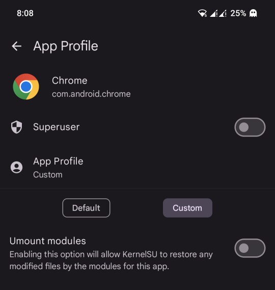

## Sıkça Sorulan Sorular

### Chrome'da Reklamlar Engellenmiyor
- Chrome için umount'un devre dışı bırakıldığından emin olun.
- **KernelSU:**
  1. Süper Kullanıcı
  2. Chrome
  3. Özel
  4. Umount modüllerini devre dışı bırak 
- Bu, diğer Chrome ve Chromium tabanlı web tarayıcıları için de geçerlidir.
- KernelSU varsayılanlarıyla sık karşılaşılan bir sorun.