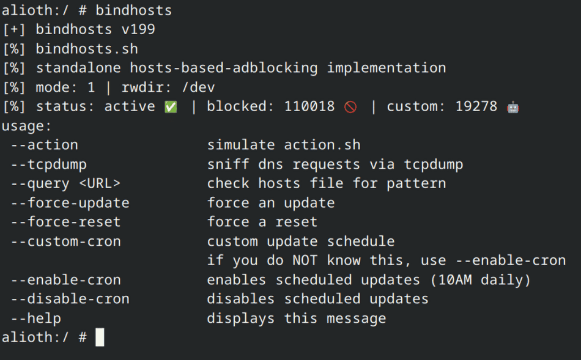

# Kullanım Kılavuzu

## Terminal Üzerinden Kullanım


Magisk/KernelSU/APatch için bindhosts’un çeşitli seçeneklerine aşağıdaki yöntemlerle erişebilirsiniz:
- Termux (veya diğer yaygın terminal uygulamaları) üzerinden:
    ```shell
    > su
    > bindhosts
    ```

- SDK Platform Tools (kök kabuğu) üzerinden:
    ```shell
    > adb shell
    > su
    > bindhosts
    ```

### Örnek
```
    bindhosts --action          Bu, bindhosts’un durumuna bağlı olarak IP’leri alma veya hosts dosyasını sıfırlama işlemini simüle eder
    bindhosts --tcpdump         Ağ modunuzda (wifi veya veri) mevcut aktif IP adreslerini koklar (Cloudflare gibi DNS hizmetlerinin kullanılmadığından emin olun)
    bindhosts --query <URL>     Hosts dosyasında desen araması yapar
    bindhosts --force-reset     Bindhosts’u zorla sıfırlar, yani hosts dosyasını sıfır IP’ye geri döndürür
    bindhosts --force-update    Güncellemeye zorlar
    bindhosts --custom-cron     Bindhosts için bir cronjob’un çalışacağı günün saatini tanımlar
    bindhosts --enable-cron     Bindhosts için cronjob görevini etkinleştirir ve şu anda kullandığınız listelerin IP’lerini güncellemek için varsayılan olarak sabah 10’da çalışır
    bindhosts --disable-cron    Daha önce ayarlanmış cronjob görevini devre dışı bırakır ve siler
    bindhosts --help            Yukarıdaki resimde ve metinde gösterilen her şeyi görüntüler
```

## Eylem
 Güncelleme ve sıfırlama arasında geçiş yapmak için eyleme basın
 
 

## Web Arayüzü
  Özel kurallarınızı, kaynaklarınızı, beyaz listenizi veya kara listenizi ekleyin
 
 
